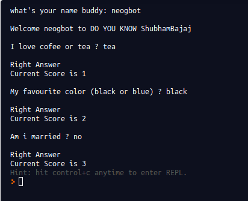

# replicating tp quiz code

- This assigment is replica of tanay pratap teach <em> cli quiz app  </em> for lecture one.
- Here I done as same as taught and did not done even a single change.
- <em>CLI Quiz</em> is simple question and answers.
- There is three questions, it is like ask the question request for the answer and tell whether your answer is correct or not.
- There is also score, but everything is fancy.
___

<h3> <u>I have used  </u></h3>

- javascript and nodejs
- npm --packet or library managment 
- readline-sync library,installed via npm
- repl.it: web based platform for collab and hosting and whatever i can.
- To see my profile on repl search: <em><strong> repl[dot]it[/]bajajshubham </strong></em>

___

- To  play checkout this: <a href="https://repl.it/@bajajshubham/cliintroprj1#index.js?embed=1&output=1"
 target="_blank">neogcamp:assignment1</a>
___
 
 </img>
